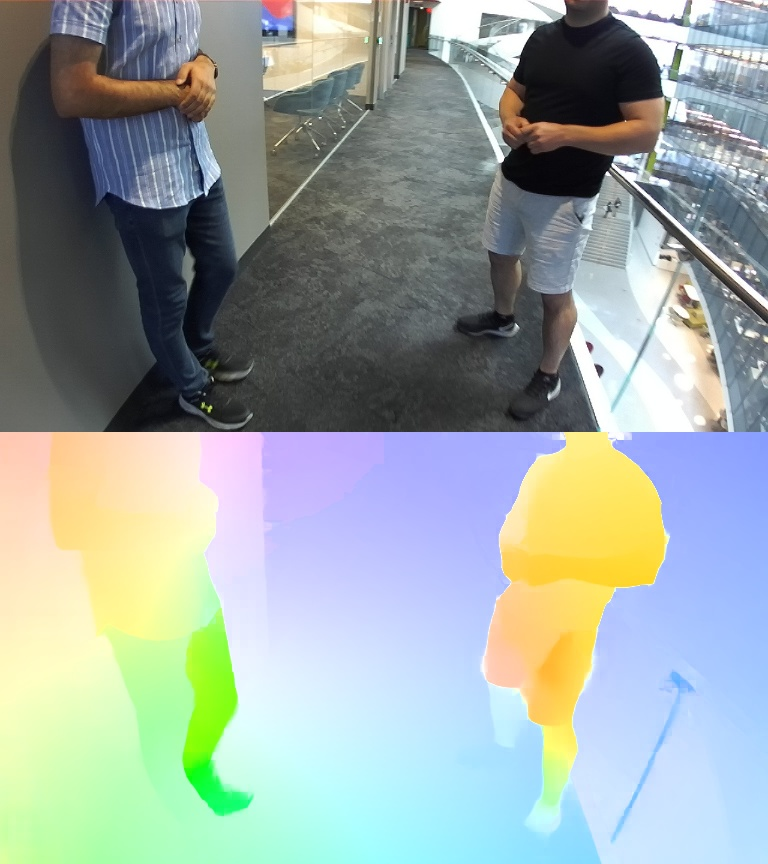

# NeuFlow_v2

Official PyTorch implementation of paper:

[NeuFlow v2: Push High-Efficiency Optical Flow To the Limit](https://arxiv.org/abs/2408.10161)

Authors: [Zhiyong Zhang](https://www.linkedin.com/in/zhiyong-zhang-0772a0159/), [Aniket Gupta](https://scholar.google.com/citations?hl=zh-CN&user=arsUOq0AAAAJ), [Huaizu Jiang](https://jianghz.me/), [Hanumant Singh](https://scholar.google.com/citations?user=1UEU5PEAAAAJ)

## Installation (PyTorch >= 2.0 is required)

```
conda create --name neuflow python==3.8
conda activate neuflow
conda install pytorch==2.0.1 torchvision==0.15.2 pytorch-cuda=11.7 -c pytorch -c nvidia
pip install numpy opencv-python
```

## Inference

Inference uses our pretrained model, trained with multiple datasets, neuflow_mixed.pth:
```
python infer.py
```



## Datasets

The datasets used to train and evaluate NeuFlow are as follows:

* [FlyingChairs](https://lmb.informatik.uni-freiburg.de/resources/datasets/FlyingChairs.en.html#flyingchairs)
* [FlyingThings3D](https://lmb.informatik.uni-freiburg.de/resources/datasets/SceneFlowDatasets.en.html)
* [Sintel](http://sintel.is.tue.mpg.de/)
* [KITTI](http://www.cvlibs.net/datasets/kitti/eval_scene_flow.php?benchmark=flow)
* [HD1K](http://hci-benchmark.iwr.uni-heidelberg.de/) 

By default the dataloader assumes the datasets are located in folder `datasets` and are organized as follows:

```
datasets
├── FlyingChairs_release
│   └── data
├── FlyingThings3D
│   ├── frames_cleanpass
│   ├── frames_finalpass
│   └── optical_flow
├── HD1K
│   ├── hd1k_challenge
│   ├── hd1k_flow_gt
│   ├── hd1k_flow_uncertainty
│   └── hd1k_input
├── KITTI
│   ├── testing
│   └── training
├── Sintel
│   ├── test
│   └── training
```

Symlink your dataset root to `datasets`:

```shell
ln -s $YOUR_DATASET_ROOT datasets
```

Convert all your images and flows to .npy format to speed up data loading. This script provides an example of converting FlyingThings cleanpass data.
```
python images_flows_to_npy.py
```

## Training

Simple training script:
```
python train.py \
--checkpoint_dir $YOUR_CHECKPOINT_DIR \
--stage things \
--val_dataset things sintel kitti \
--batch_size 32 \
--num_workers 4 \
--lr 1e-4 \
--val_freq 1000 \
--resume neuflow_things.pth \
--strict_resume
```

We trained on the FlyingThings dataset using 8x A5000 GPUs with the following command:
```
python -m torch.distributed.launch --nproc_per_node=8 --master_port=29501 train.py \
--checkpoint_dir $YOUR_CHECKPOINT_DIR \
--stage things \
--val_dataset things sintel kitti \
--batch_size 256 \
--num_workers 8 \
--lr 8e-4 \
--val_freq 500 \
--distributed
```

## Evaluation

```
python eval.py \
--resume neuflow_things.pth
```
